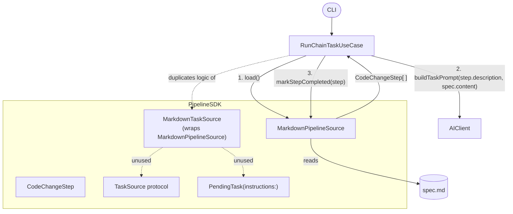
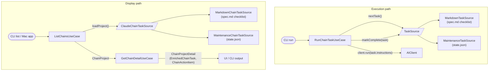

## Relevant Skills

| Skill | Description |
|-------|-------------|
| `configuration-architecture` | Guide for wiring new config through the app layers |
| `logging` | Add logging to new discovery and execution paths |
| `swift-app-architecture:swift-architecture` | 4-layer architecture — new feature spans SDK, Service, Feature, and Apps layers |

## Architecture Diagrams

### Before: RunChainTaskUseCase bypasses TaskSource

`RunChainTaskUseCase` duplicates inline what `MarkdownTaskSource` already does — it uses `MarkdownPipelineSource` and `CodeChangeStep` directly rather than calling `MarkdownTaskSource`. `TaskSource` and `PendingTask` go unused.



### After: Two protocols, one shared downstream

Two new protocols cover the two concerns. Everything downstream of extraction — enrichment, display models, action items — is shared unchanged.

**Execution path** — `TaskSource` (existing, in `PipelineSDK`): returns one `PendingTask` with instructions built in. Used by `RunChainTaskUseCase`.

**Display path** — `ClaudeChainTaskSource` (new, in `ClaudeChainService`): returns a full `ChainProject` with all tasks. Used by `ListChainsUseCase` and `GetChainDetailUseCase`.



`ChainProject` gains a `branchPrefix` field (`"claude-chain-<name>-"`) so `GetChainDetailUseCase` can match PRs to tasks without hardcoding the ClaudeChain prefix.

---

## Background

Maintenance is **ClaudeChain operating in a different configuration**, not a standalone feature. ClaudeChain's pipeline is made configurable via the `TaskSource` protocol; Maintenance plugs in its own implementation. Unlike the default ClaudeChain mode (finite user-authored checklist in `spec.md`), maintenance tasks are **ongoing**: each task runs against a file or directory path, records the git hash when it last ran, and re-runs only when that path changes.

### Core Architectural Insight

`TaskSource` and `PendingTask` already exist in `PipelineSDK`:

```swift
public protocol TaskSource: Sendable {
    func nextTask() async throws -> PendingTask?
    func markComplete(_ task: PendingTask) async throws
}

public struct PendingTask: Sendable, Identifiable {
    public let id: String
    public let instructions: String   // full AI prompt — built by the task source
    public let skills: [String]
}
```

`MarkdownTaskSource` already implements `TaskSource` for ClaudeChain (reads spec.md checklist, has an `instructionBuilder` closure). `RunChainTaskUseCase` imports `PipelineSDK` and uses `MarkdownPipelineSource`/`CodeChangeStep` directly, duplicating inline what `MarkdownTaskSource` already does. `TaskSource` and `PendingTask` go unused. That is the Phase 0 refactor.

A second protocol handles the display side. `ClaudeChainTaskSource` lives in `ClaudeChainService` and returns a `ChainProject` — the same model already used by `ListChainsUseCase`, `GetChainDetailUseCase`, and the Mac app:

```swift
public protocol ClaudeChainTaskSource: Sendable {
    func loadProject() async throws -> ChainProject
}
```

Once either implementation produces a `ChainProject`, the entire downstream pipeline — GitHub PR enrichment, `EnrichedChainTask`, `ChainActionItem`, `ChainProjectDetail`, display views — is shared with no duplication.

`ChainProject` gains one new field: `branchPrefix: String`. `GetChainDetailUseCase` currently hardcodes `"claude-chain-"` when matching PRs to tasks; this field replaces that. Both ClaudeChain and Maintenance set it to `"claude-chain-<name>-"`.

For Maintenance, `ChainTask` maps naturally from state.json: `description` = file path, `isCompleted` = hash is current (not stale), `index` = sorted position.

| Abstraction | Purpose | ClaudeChain impl | Maintenance impl |
|---|---|---|---|
| `TaskSource` | Execution — next task to run, mark done | `MarkdownTaskSource` — spec.md checklist, marks `[x]` | `MaintenanceTaskSource` — state.json stale paths, updates hash |
| `ClaudeChainTaskSource` | Display — all tasks with status | `MarkdownChainTaskSource` — spec.md → `ChainProject` | `MaintenanceChainTaskSource` — state.json → `ChainProject` |
| `ChainProject.branchPrefix` | PR matching in enrichment | `"claude-chain-<name>-"` | `"claude-chain-<name>-"` |

### Key Design Principles

- **`lastRunHash` recorded post-commit**: After the AI edits the path and commits to the feature branch, record the git hash of the path *from that branch commit*. When the PR merges cleanly, the base branch ends up with the same hash — discovery will not mark the task stale again.
- **Discovery is separate from execution**: A discovery job expands a glob, diffs against state.json, and adds/removes/updates entries. It never runs tasks.
- **Single path per task**: Each state.json entry is one file or directory path. No multi-file groups in V1.
- **Top-to-bottom execution (V1)**: Execution picks the first stale task from state.json in key-sorted order. Lexicographic starvation is acceptable for V1.
- **PR output**: Each task execution results in a GitHub PR with the AI's changes.
- **Branch naming**: `claude-chain-<task-name>-<hash>` where `<hash>` is an 8-char SHA-256 of the path string. Same prefix convention as ClaudeChain.
- **Reuse PipelineService**: Task execution pipelines use the existing `PipelineService` and `PipelineSDK`.

### File Layout Per Maintenance Task

```
claude-chain-maintenance/<task-name>/
  config.yaml    # maxOpenPRs, discovery glob pattern
  spec.md        # AI instructions ONLY — no checklist, no file paths
  state.json     # task source: path → {lastRunHash, lastRunAt}
```

### `spec.md` Format

Free-form AI instructions only. No checklist. `MaintenanceTaskSource` appends the file path at execution time before returning the `PendingTask`.

```markdown
Review this file for service layer convention compliance. Remove dead code,
fix naming, and ensure protocol conformance is correct. If the file already
conforms well, make no changes and explain why in the PR description.
```

### `state.json` Schema

Machine-managed. Keys are path strings sorted alphabetically. Written by discovery and updated by the executor.

```json
{
  "Sources/Services/BarService.swift": {
    "lastRunAt": "2026-04-03T12:00:00Z",
    "lastRunHash": "abc12345"
  },
  "Sources/Services/FooService.swift": {
    "lastRunAt": null,
    "lastRunHash": null
  }
}
```

- `lastRunHash` — git blob SHA (file) or git tree SHA (directory) of the path as it existed on the feature branch **after the AI's commits**, not the pre-run base branch hash. `null` = never run.
- `lastRunAt` — ISO-8601 timestamp of last successful execution. `null` = never run. Informational; ordering is by sorted key in V1.
- The current hash is **not stored** — computed at runtime via `git rev-parse HEAD:<path>`.
- A task is stale when `lastRunHash == null` OR current hash ≠ `lastRunHash`.

### `config.yaml` Schema

```yaml
maxOpenPRs: 1
discovery:
  glob: "Sources/Services/**/*.swift"
```

### Hashing

- **File path**: git blob SHA — `git rev-parse HEAD:<path>`
- **Directory path**: git tree SHA — `git rev-parse HEAD:<dir>` — changes when any file under it is added, modified, or deleted

---

## - [ ] Phase 0: Refactor RunChainTaskUseCase to use MarkdownTaskSource

**Skills to read**: `swift-app-architecture:swift-architecture`

**Prerequisite for all other phases.** Two changes, both must leave ClaudeChain behavior unchanged:

**1. Execution — wire `RunChainTaskUseCase` to `MarkdownTaskSource`.**
`TaskSource`, `PendingTask`, and `MarkdownTaskSource` already exist in `PipelineSDK`. `RunChainTaskUseCase` manually duplicates their logic. Rewrite it to delegate task selection, prompt construction, and mark-complete to `MarkdownTaskSource`. The `instructionBuilder` closure replaces `buildTaskPrompt()`.

**2. Display — introduce `ClaudeChainTaskSource` and `MarkdownChainTaskSource`.**
Define the `ClaudeChainTaskSource` protocol in `ClaudeChainService`. Implement `MarkdownChainTaskSource` (extracts the existing spec.md → `ChainProject` logic out of `ListChainsUseCase`). Refactor `ListChainsUseCase` to use it.

Add `branchPrefix: String` to `ChainProject`. Refactor `GetChainDetailUseCase` to use `project.branchPrefix` instead of the hardcoded `"claude-chain-"` string.

Files to modify:
- `Sources/Features/ClaudeChainFeature/usecases/RunChainTaskUseCase.swift`
- `Sources/Services/ClaudeChainService/ChainModels.swift` (add `branchPrefix`)
- `Sources/Services/ClaudeChainService/ClaudeChainTaskSource.swift` (new protocol)
- `Sources/Services/ClaudeChainService/MarkdownChainTaskSource.swift` (new)
- `Sources/Features/ClaudeChainFeature/usecases/ListChainsUseCase.swift` (use `MarkdownChainTaskSource`)
- `Sources/Features/ClaudeChainFeature/usecases/GetChainDetailUseCase.swift` (use `project.branchPrefix`)

---

## - [ ] Phase 1: Define Maintenance SDK models

**Skills to read**: `swift-app-architecture:swift-architecture`

Create a new `MaintenanceSDK` target in `Package.swift` (alphabetically placed).

**`MaintenanceStateEntry`**:
```swift
public struct MaintenanceStateEntry: Codable, Sendable {
    public var lastRunAt: Date?
    public var lastRunHash: String?   // git blob/tree SHA from feature branch post-commit. nil = never run.
}
```

**`MaintenanceState`** — `state.json` wrapper:
```swift
public struct MaintenanceState: Codable, Sendable {
    public var entries: [String: MaintenanceStateEntry]   // key = file/dir path
}
```
Includes `load(from: URL)` and `save(to: URL)` with atomic write and ISO-8601 date encoding. Keys always sorted alphabetically on save.

**`MaintenanceConfig`** — parsed from `config.yaml` via `Yams`:
```swift
public struct MaintenanceConfig: Sendable {
    public let maxOpenPRs: Int        // default: 1
    public let discoveryGlob: String
}
```

**`MaintenanceTaskSource`** — implements `TaskSource` using `state.json`:
- `nextTask()`: load state, sort keys, find first entry where `lastRunHash == nil` OR current hash ≠ `lastRunHash`; read `spec.md`; return `PendingTask(id: path, instructions: specContent + "\n\nFile: \(path)", skills: [])`
- `markComplete(_ task:)`: fetch git blob/tree SHA for `task.id` from current branch; update `lastRunHash` and `lastRunAt`; save state

**`MaintenanceChainTaskSource`** — implements `ClaudeChainTaskSource` for display:
- `loadProject()`: load state.json; map each entry to `ChainTask(index: sortedPosition, description: path, isCompleted: hashIsCurrent)`; return `ChainProject(name: taskName, tasks:..., branchPrefix: "claude-chain-<taskName>-", ...)`
- Once this returns a `ChainProject`, `GetChainDetailUseCase` and all enrichment/display logic runs unchanged.

Files:
- `Sources/SDKs/MaintenanceSDK/MaintenanceConfig.swift`
- `Sources/SDKs/MaintenanceSDK/MaintenanceState.swift`
- `Sources/SDKs/MaintenanceSDK/MaintenanceStateEntry.swift`
- `Sources/SDKs/MaintenanceSDK/MaintenanceTaskSource.swift`
- `Sources/Services/ClaudeChainService/MaintenanceChainTaskSource.swift` (new — implements `ClaudeChainTaskSource`)

---

## - [ ] Phase 2: Discovery Service

**Skills to read**: `swift-app-architecture:swift-architecture`, `logging`

Create a `MaintenanceService` target. Discovery expands the glob, diffs against state.json, and updates it. Does **not** execute tasks and does **not** touch spec.md (spec.md is human-authored instructions only).

```swift
func discover(config: MaintenanceConfig, repoPath: String, taskDirectoryURL: URL) async throws -> DiscoverySummary
```

Steps:
1. Load existing `MaintenanceState` from `taskDirectoryURL/state.json` (or start empty).
2. Expand `config.discoveryGlob` against the repo using `FileManager`.
3. Diff against existing entries:
   - **New path**: add entry with `lastRunHash: nil`, `lastRunAt: nil`.
   - **Obsolete path** (no longer matched by glob): remove entry.
   - **Existing path**: no change to stored fields — staleness is evaluated at execution time.
4. Save updated state.json (keys sorted alphabetically).
5. Return `DiscoverySummary(added:, removed:, total:, pendingCount:)` where `pendingCount` is entries with null or stale hashes.

Add `Logger(label: "MaintenanceDiscoveryService")` at each step.

Files:
- `Sources/Services/MaintenanceService/DiscoverySummary.swift`
- `Sources/Services/MaintenanceService/MaintenanceDiscoveryService.swift`
- `Sources/Services/MaintenanceService/MaintenanceDiscoveryServiceProtocol.swift`

---

## - [ ] Phase 3: Execution Service

**Skills to read**: `swift-app-architecture:swift-architecture`, `logging`

`MaintenanceExecutionService` uses `MaintenanceTaskSource` to build and run a pipeline.

```swift
func executeNext(config: MaintenanceConfig, repoPath: String, taskDirectoryURL: URL) async throws -> MaintenanceExecutionResult
```

Steps:
1. Instantiate `MaintenanceTaskSource` from task directory.
2. Call `taskSource.nextTask()`. If nil, return `.noWork`.
3. Check open PR count vs `config.maxOpenPRs`. If at or above limit, return `.atCapacity`. Check if this path's branch already has an open PR — if so, skip and try next task.
4. Verify the path still exists on disk (may have been deleted since discovery ran). If missing, skip and log warning.
5. Execute via `PipelineRunner` using the `PendingTask` from `nextTask()`.
6. On success: call `taskSource.markComplete(task)` — fetches post-commit hash from feature branch, updates state.json.
7. On failure: leave state unchanged. Log error.

Branch name: `claude-chain-<task-name>-<8-char-sha256-of-path>`.

```swift
enum MaintenanceExecutionResult: Sendable {
    case atCapacity(openCount: Int, maxOpen: Int)
    case completed(prURL: String)
    case failed(error: any Error & Sendable)
    case noWork
}
```

Files:
- `Sources/Services/MaintenanceService/MaintenanceExecutionResult.swift`
- `Sources/Services/MaintenanceService/MaintenanceExecutionService.swift`
- `Sources/Services/MaintenanceService/MaintenanceExecutionServiceProtocol.swift`

---

## - [ ] Phase 4: MaintenanceFeature use cases

**Skills to read**: `swift-app-architecture:swift-architecture`

Create a `MaintenanceFeature` target with two use cases. Each takes a task directory URL and resolves `config.yaml`, `spec.md`, and `state.json` from it.

**`RunMaintenanceDiscoveryUseCase`**
- Reads `config.yaml`; calls `MaintenanceDiscoveryService.discover(...)`
- Returns `DiscoverySummary`

**`RunMaintenanceTaskUseCase`**
- Reads `config.yaml`; calls `MaintenanceExecutionService.executeNext(...)`
- Returns `MaintenanceExecutionResult`

Files:
- `Sources/Features/MaintenanceFeature/RunMaintenanceDiscoveryUseCase.swift`
- `Sources/Features/MaintenanceFeature/RunMaintenanceTaskUseCase.swift`

---

## - [ ] Phase 5: CLI commands

**Skills to read**: `swift-app-architecture:swift-architecture`

Add a `maintenance` subcommand to `ai-dev-tools-kit` (alphabetically in the subcommand list):

**`maintenance discover`**
```
swift run ai-dev-tools-kit maintenance discover --task <path-to-task-dir> --repo <repo-path>
```
Prints: N added, N removed, N total, N pending.

**`maintenance run`**
```
swift run ai-dev-tools-kit maintenance run --task <path-to-task-dir> --repo <repo-path>
```
Prints PR URL, "no work", or capacity message.

Files:
- `Sources/Apps/AIDevToolsKitCLI/MaintenanceCommand.swift`

---

## - [ ] Phase 6: Validation

**Skills to read**: `logging`

**Unit tests** — `MaintenanceSDKTests`:
- `MaintenanceStateTests`: round-trip `Codable` encoding; atomic save/load; keys sorted on save.
- `MaintenanceTaskSourceTests`: `nextTask()` returns nil when all hashes current; returns stale entry when hash differs; `PendingTask.instructions` contains spec.md content and file path.

**CLI smoke test**:
```bash
mkdir -p /tmp/test-maintenance
echo "maxOpenPRs: 1\ndiscovery:\n  glob: Sources/Services/**/*.swift" > /tmp/test-claude-chain-maintenance/config.yaml
echo "Review this file for service layer compliance." > /tmp/test-claude-chain-maintenance/spec.md

swift run ai-dev-tools-kit maintenance discover --task /tmp/test-maintenance --repo <repo>
# Verify state.json created with null hashes for all matched paths

swift run ai-dev-tools-kit maintenance run --task /tmp/test-maintenance --repo <repo>
# Verify PR created; state.json updated with hash + date for first path

swift run ai-dev-tools-kit maintenance discover --task /tmp/test-maintenance --repo <repo>
# Verify that completed path still shows as up-to-date (hash matches)

swift run ai-dev-tools-kit maintenance run --task /tmp/test-maintenance --repo <repo>
# Verify second stale path runs next
```

**Log verification**:
```bash
cat ~/Library/Logs/AIDevTools/aidevtools.log | jq 'select(.label | startswith("Maintenance"))'
```

**ClaudeChain regression** (after Phase 0):
- Run existing ClaudeChain tests to confirm behavior is unchanged after the `RunChainTaskUseCase` refactor.
